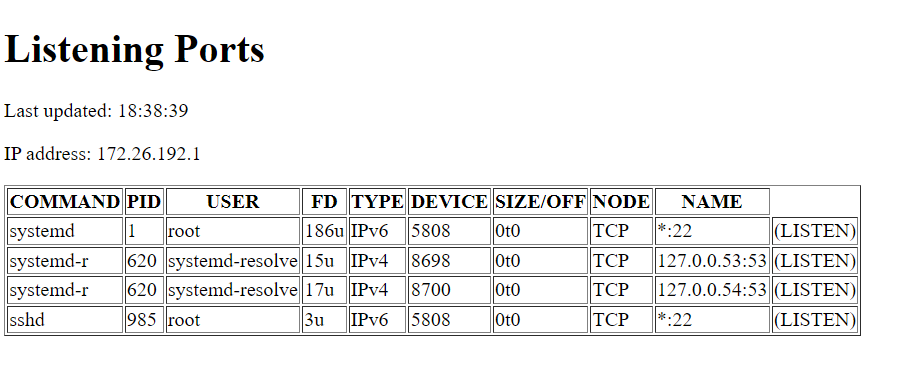

# Проект по предоставлению информации о портах

## Установка и запуск

```bash
git clone git@github.com:Gigerin/test_STC.git
pip install -r requirements.txt
cd test_stc
python manage.py migrate
python manage.py runserver
```

## Использование

Перейдите по адресу 127.0.0.1 в браузере, введите небходимую для SSH подключения
информацию и нажмите Enter. Информация о портах будет представляться в виде таблице
как на картинке ниже \ 
